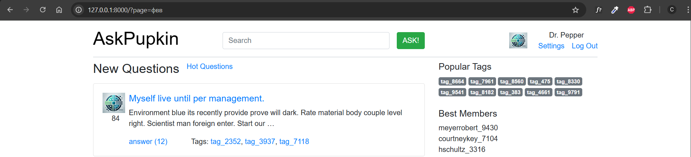
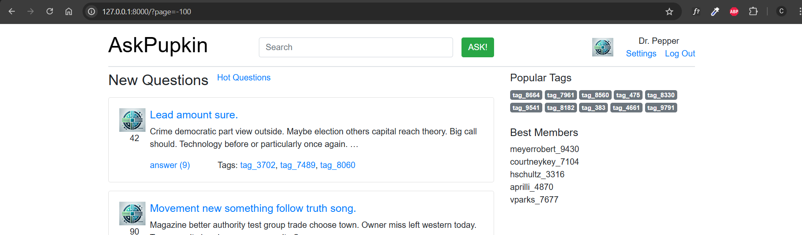

Домашнее задание 2
====

Обработка HTTP запросов
----
Целью домашнего задания является:

- создание основных view сайта (отображающих “рыбу”);
- настройка маршрутизации URL;
- использование шаблонизатора для генерации HTML;
- постраничное отображение (пагинация).


Баллы
---

**Максимальные баллы за ДЗ - 14 баллов**

Создать views и шаблоны для основных страниц - 6
---
[Файл views](../../views.py)

- [X] Главная - 1;
  
  [Список вопросов](../../templates/questions.html)


  [Карточка вопросов](../../templates/question.html)
  [Базовый файл](../../templates/base.html)
  
- [X] Страница вопроса (список ответов) - 1;

- [X] Страница добавления вопроса - 1;

  [Добавление вопроса](../../templates/ask.html)


- [X] Форма регистрации - 1;

  [Регистрация](../../templates/singup.html)

  
- [X] Форма входа - 1;
  
  [Вход](../../templates/login.html)

  
- [X] форма редактирования профиля - 1.
  
  [Настройки](../../templates/setting.html)


Создать urls.py для всех страниц - 4:
---

- [X] Собственно urls.py - 2;
  
``` python
from django.contrib import admin
from django.urls import path
from . import views


urlpatterns = [
    path('', views.question_list_view, name='question-list'),
    path('top-likes/', views.top_liked_questions, name='top-liked-questions'),
    path('question/<int:question_id>/', views.question_detail, name='question_detail'),
    path('tag/<str:tag_name>/', views.tag_detail, name='tag_detail'),
    path('new-ask/', views.new_ask, name='new_ask'),
    path('login/', views.login, name='login'),
    path('singup/', views.singup, name='singup'),
    path('setting/', views.setting, name='setting'),
    path('base/', views.base, name='base'),
]
```
- [X] Именованные маршруты (во всех шаблонах) - 2.
  
  sidebar.html
  ``` html
    <div class="mb-4">
    <h5>Popular Tags</h5>
    <p class="custom-links">
        
            <a href="" class="badge bg-secondary">{{ tag.name }}</a> 
        
    </p>
    </div>
  ```

  quesion.html
  ```html
  <div class="card mb-3">
    <div class="card-body d-flex">
      <div class="text-center me-4">
        
        <p>{{ question.vote_count }}</p>  
      </div>
    <div>
    <h5><a href="">{{ question.title }}</a></h5>
    <p>{{ question.content|truncatewords:20 }}</p>
    <a href="" class="mr-5">answer ({{ question.answer_count }})</a>  
    <p class="d-inline ms-2">Tags: 
    
    <a href=/tag/{{tag.name}}/>{{ tag.name }}</a>, 
    
    </p>
  </div>
  </div>
  </div>
  ```


Постраничное отображение - 4:
---

- [X] Пагинация - 1;
```html
<nav aria-label="Page navigation">
  <ul class="pagination">
  
  <li class="page-item">
  <a class="page-link" href="?page=1">&laquo; First</a>
  </li>
    <li class="page-item">
    <a class="page-link" href="?page={{ questions.previous_page_number }}">Previous</a>
  </li>
  
    
  
  
  <li class="page-item active"><span class="page-link">{{ num }}</span></li>
  
  <li class="page-item"><a class="page-link" href="?page={{ num }}">{{ num }}</a></li>
  
  
    
  
  <li class="page-item">
  <a class="page-link" href="?page={{ questions.next_page_number }}">Next</a>
  </li>
  <li class="page-item">
  <a class="page-link" href="?page={{ questions.paginator.num_pages }}">Last &raquo;</a>
  </li>
  
  </ul>
  </nav>
```
- [X] шаблон для отрисовки пагинатора - 2;

- [X] корректная обработка “неправильных” параметров - 1.
  
  

  

