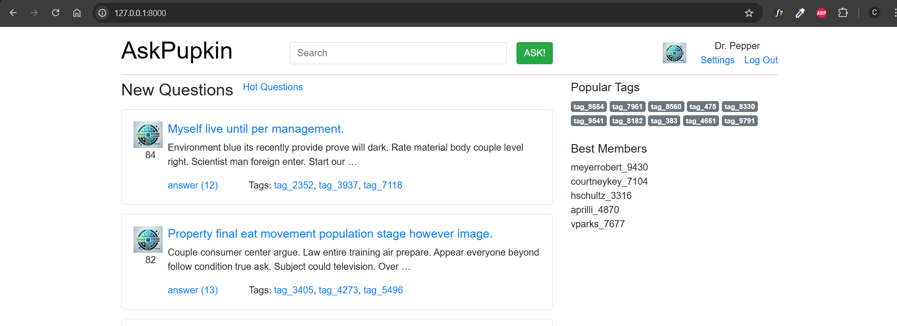
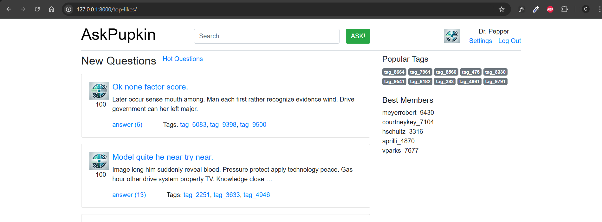
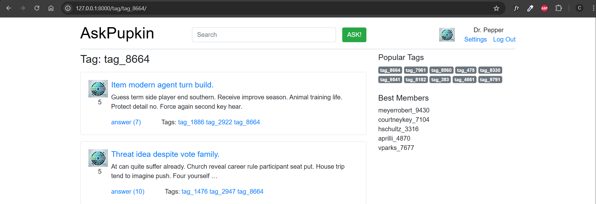
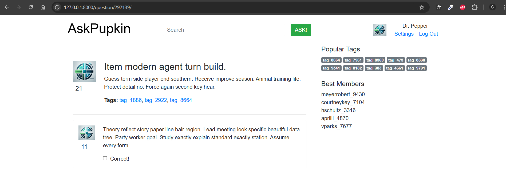

# Домашнее задание 3

## Проектирование модели данных

Целью домашнего задания является проектирование модели базы данных, наполнение ее тестовыми данными и и отображение этих данных на сайте. Таким образом будет создана read-only версия сайта.

### 3. Наполнение данными
Требования к объему данных:
- Пользователи > 10 000.
- Вопросы > 100 000.
- Ответы > 1 000 000.
- Тэги > 10 000.
- Оценки пользователей > 2 000 000.

**Внимание!** Management command должна быть вида: 
```Bash
python manage.py fill_db [ratio]
```
Где num_users — коэффициент заполнения сущностей. Соответственно, после применения команды в базу должно быть добавлено:
 - пользователей — равное ratio;
 - вопросов — ratio * 10;
 - ответы — ratio * 100;
 - тэгов - ratio;
 - оценок пользователей - ratio * 200;

### 6. Баллы

#### Максимальные баллы за ДЗ - 16 баллов

Проектирование модели - 5:
```python
from django.db import models
from django.contrib.auth.models import User
# Модель для вопросов
class Question(models.Model):
    title = models.CharField(max_length=255)
    content = models.TextField()
    author = models.ForeignKey(User, on_delete=models.CASCADE, related_name='questions')
    created_at = models.DateTimeField(auto_now_add=True)
    updated_at = models.DateTimeField(auto_now=True)
    tags = models.ManyToManyField(Tag, related_name='questions')
    vote_count = models.IntegerField(default=0)
    answer_count = models.IntegerField(default=0)

    objects = QuestionManager()

    def __str__(self):
        return self.title

    def get_absolute_url(self):
        return f"/questions/{self.id}/"

# Модель для ответов
class Answer(models.Model):
    question = models.ForeignKey(Question, on_delete=models.CASCADE, related_name='answers')
    author = models.ForeignKey(User, on_delete=models.CASCADE, related_name='answers')
    content = models.TextField()
    created_at = models.DateTimeField(auto_now_add=True)
    updated_at = models.DateTimeField(auto_now=True)
    vote_count = models.IntegerField(default=0)

    def __str__(self):
        return f'Answer by {self.author} on {self.question}'


```
- [X] правильные адекватные типы данных и внешние ключи - 1;
- [X] своя модель пользователя - 1;
```python

# Модель для профиля пользователя
class Profile(models.Model):
    user = models.OneToOneField(User, on_delete=models.CASCADE, related_name="profile")
    avatar = models.ImageField(upload_to='avatars/', null=True, blank=True)
    bio = models.TextField(null=True, blank=True)

    def __str__(self):
        return self.user.username
```
- [X] таблицы тегов, лайков - 1;
```python

# Модель для тегов
class Tag(models.Model):
    name = models.CharField(max_length=50, unique=True)

    def __str__(self):
        return self.name
# Модель для лайков вопросов
class QuestionLike(models.Model):
    user = models.ForeignKey(User, on_delete=models.CASCADE)
    question = models.ForeignKey(Question, on_delete=models.CASCADE)

    class Meta:
        unique_together = ('user', 'question')  

    def __str__(self):
        return f'{self.user} likes {self.question}'

# Модель для лайков ответов
class AnswerLike(models.Model):
    user = models.ForeignKey(User, on_delete=models.CASCADE)
    answer = models.ForeignKey(Answer, on_delete=models.CASCADE)

    class Meta:
        unique_together = ('user', 'answer')  

    def __str__(self):
        return f'{self.user} likes {self.answer}'

```
- [X] query-set для типовых выборок: новые вопросы, популярные, по тегу - 2.
```python
class QuestionManager(models.Manager):
    def best(self):
        return self.filter(vote_count__gt=10).order_by('-vote_count')  

    def new(self):
        return self.order_by('-created_at')  
```
Наполнение базы тестовыми данными - 3:

- [X] скрипт для наполнения данными - 1;
  
  [Файл](../../management/commands/fill_db.py)
- [X] использование django management commands - 1;
- [X] соблюдение требований по объему данных - 1.

Отображение списка вопросов - 3:

```python
def question_detail(request, question_id):
    question = get_object_or_404(Question.objects.annotate(num_answers=Count('answers')), id=question_id)
    answers = Answer.objects.filter(question=question)

    popular_tags, best_users = get_popular_tags_and_best_users()

    return render(request, 'question.html', {
        'question': question,
        'answers': answers,
        'popular_tags': popular_tags,
        'best_users': best_users,
    })

def question_list_view(request):
    questions = Question.objects.annotate(num_answers=Count('answers')).order_by('-id')
    paginator = Paginator(questions, 20)

    page_number = request.GET.get('page')
    page_obj = paginator.get_page(page_number)

    popular_tags, best_users = get_popular_tags_and_best_users()

    context = {
        'questions': page_obj,
        'popular_tags': popular_tags,
        'best_users': best_users,
    }
    
    return render(request, 'questions.html', context)

def top_liked_questions(request):
    top_questions = Question.objects.annotate(num_answers=Count('answers')).order_by('-vote_count')[:5]
    paginator = Paginator(top_questions, 20)

    page_number = request.GET.get('page')
    page_obj = paginator.get_page(page_number)

    popular_tags, best_users = get_popular_tags_and_best_users()

    context = {
        'questions': page_obj,
        'popular_tags': popular_tags,
        'best_users': best_users,
    }
    
    return render(request, 'questions.html', context)

```

- [X] список новых вопросов - 1;
  
  

- [X] список популярных - 1;
  
  

- [X] список вопросов по тегу - 1
  
  

Отображение страницы вопроса - 3:

- [X] общее - 3.
  
  

Использование СУДБ - 2:

```python
DATABASES = {
     'default': {
        'ENGINE': 'django.db.backends.postgresql',
        'NAME': 'tp_web_2', 
        'USER': 'admin',
        'PASSWORD': 'admin',
        'HOST': '91.184.243.246',
        'PORT': 7474, 
    }  
}
```

- [X] MySQL или PostgreSQL - 2.
